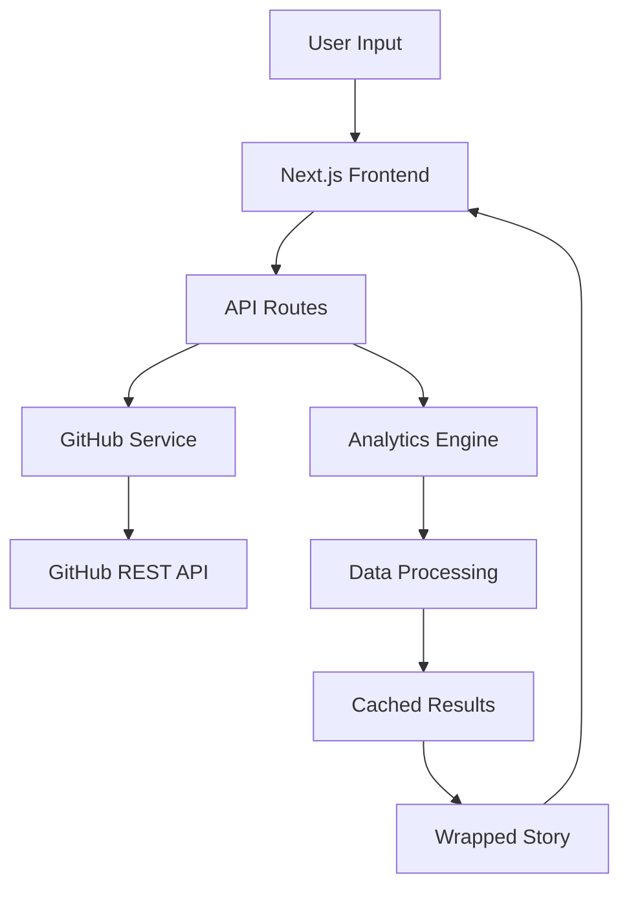

## Overview

GitHub Wrapped is built as a modern Next.js application that transforms GitHub repository data into beautiful, shareable year-in-review visualizations. The architecture follows a clear separation of concerns with distinct layers for data fetching, analytics processing, and presentation.

## High-Level Architecture

## Data Flow

The application follows a streamlined data pipeline:

<Steps>
  <Step title="User Input">
    Users enter a repository in format `owner/repo` and select a year through the `RepositoryInput` component.
  </Step>
  
  <Step title="Validation">
    The `/api/validate` endpoint validates the repository exists and is public before proceeding.
  </Step>
  
  <Step title="Cache Check">
    The system checks Redis (if configured) or in-memory cache for existing wrapped data to avoid redundant API calls.
  </Step>
  
  <Step title="GitHub API Fetching">
    If no cache exists, `GitHubService` (`lib/github.ts:11`) makes parallel requests to GitHub's REST API using Octokit to fetch:
    - Repository info, contributors, commits
    - Languages, releases, issues, pull requests
    - Stars, forks, and community metrics
  </Step>
  
  <Step title="Analytics Processing">
    `AnalyticsEngine` (`lib/analytics.ts:24`) processes raw GitHub data to calculate:
    - Commit statistics (by month, day, hour)
    - Contributor rankings and activity
    - Language distribution and trends
    - Community growth metrics
    - Monthly activity snapshots
  </Step>
  
  <Step title="Caching">
    Processed data is cached for 24 hours to improve performance and reduce API usage.
  </Step>
  
  <Step title="Presentation">
    The `WrappedStory` component renders 8-12 animated slides using Framer Motion, presenting insights in a Spotify-inspired format.
  </Step>
</Steps>

## Component Architecture

### Frontend Components

<CardGroup cols={2}>
  <Card title="Input Layer" icon="keyboard">
    - `RepositoryInput.tsx` - Repository search and validation
    - `PeriodSelector.tsx` - Year/period selection
    - Form validation and error handling
  </Card>
  
  <Card title="Presentation Layer" icon="sparkles">
    - `WrappedStory.tsx` - Main story container and navigation
    - `WrappedSlide.tsx` - Individual slide components (8-12 slides)
    - `UserWrappedStory.tsx` / `UserWrappedSlide.tsx` - User-specific wrapped
  </Card>
  
  <Card title="UI Components" icon="palette">
    - Radix UI primitives for accessible components
    - Custom styled components in `components/ui/`
    - Theme provider for dark/light mode
  </Card>
  
  <Card title="Layout Components" icon="layout-dashboard">
    - `hero.tsx` - Landing page hero section
    - `theme-toggle.tsx` - Theme switching
    - Root layout with metadata and providers
  </Card>
</CardGroup>

### Backend Services

<Accordion title="GitHub Service (lib/github.ts)">
  **Responsibilities:**
  - Octokit client initialization with optional authentication
  - Rate limit checking and management
  - Repository validation and info retrieval
  - Paginated data fetching for commits, contributors, issues, PRs
  - User profile and repository queries
  
  **Key Methods:**
  - `validateRepository()` - Checks repo existence and accessibility
  - `getCommits()` - Fetches commits with date filtering
  - `getContributors()` - Retrieves contributor statistics
  - `getLanguages()` - Gets language breakdown
  - `getUserRepos()` - Fetches user's repositories
</Accordion>

<Accordion title="Analytics Engine (lib/analytics.ts)">
  **Responsibilities:**
  - Transforms raw GitHub data into meaningful insights
  - Calculates aggregated statistics and trends
  - Identifies patterns in commit activity
  - Ranks contributors and languages
  - Generates monthly activity snapshots
  
  **Key Methods:**
  - `generateWrapped()` - Main entry point for repository wrapped
  - `generateUserWrapped()` - Generates user-level wrapped data
  - `calculateCommitStats()` - Analyzes commit patterns
  - `calculateContributorStats()` - Ranks top contributors
  - `buildMonthlySnapshots()` - Creates time-series data
</Accordion>

<Accordion title="Cache Layer (lib/cache.ts)">
  **Responsibilities:**
  - Dual-layer caching: Redis (production) + in-memory (fallback)
  - 24-hour TTL for wrapped data
  - Validation result caching
  - Automatic expiration and cleanup
  
  **Implementation:**
  - Uses Upstash Redis when configured
  - Falls back to Map-based in-memory cache
  - Type-safe cache entries with expiration tracking
</Accordion>

## API Route Organization

The application exposes several API endpoints through Next.js App Router:

| Route | Purpose | Method |
|-------|---------|--------|
| `/api/validate` | Validate repository existence | POST |
| `/api/wrapped` | Generate repository wrapped | POST |
| `/api/wrapped/user` | Generate user wrapped | POST |
| `/api/summary` | Get quick repository summary | POST |
| `/api/performance` | Performance metrics endpoint | POST |
| `/api/og` | Open Graph image generation | GET |
| `/api/auth/[...all]` | Authentication endpoints (better-auth) | ALL |
| `/api/user/repos` | Get authenticated user's repos | GET |

## Authentication Flow

GitHub Wrapped uses [better-auth](https://better-auth.com) for authentication:

1. Users can optionally sign in with GitHub OAuth
2. Authenticated requests use the user's GitHub token for higher rate limits
3. Session management handled by better-auth with PostgreSQL storage
4. Auth state persisted across requests via secure cookies

## Caching Strategy

<CardGroup cols={2}>
  <Card title="Production (Redis)" icon="database">
    - Upstash Redis for distributed caching
    - Persistent across deployments
    - Shared cache for all users
    - 24-hour expiration
  </Card>
  
  <Card title="Development (In-Memory)" icon="memory">
    - Map-based in-memory cache
    - Automatic fallback if Redis unavailable
    - Per-process cache (not shared)
    - Same 24-hour expiration
  </Card>
</CardGroup>

## Type Safety

The entire application is built with TypeScript, with comprehensive type definitions in `types/index.ts`:

- `WrappedData` - Repository wrapped data structure
- `UserWrappedData` - User-level wrapped data
- `CommitStats` - Commit analytics
- `Contributor` - Contributor information
- `LanguageStats` - Language distribution
- `MonthlySnapshot` - Time-series activity data

## Performance Optimizations

<Steps>
  <Step title="Parallel API Requests">
    GitHub API calls are batched using `Promise.all()` to minimize latency.
  </Step>
  
  <Step title="Pagination Limits">
    Request limits (typically 5-10 pages max) prevent rate limit exhaustion on large repositories.
  </Step>
  
  <Step title="Sampling for Expensive Operations">
    Line-by-line commit stats are sampled (max 20 commits) to balance detail with performance.
  </Step>
  
  <Step title="Progressive Data Loading">
    User wrapped limits deep scanning to top 15 most active repositories.
  </Step>
  
  <Step title="Caching">
    24-hour cache dramatically reduces load on GitHub API and improves response times.
  </Step>
</Steps>

## Deployment Architecture

The application is designed for deployment on Vercel:

- **Hosting**: Vercel Edge Network
- **Database**: PostgreSQL (for auth sessions via Prisma)
- **Cache**: Upstash Redis (serverless Redis)
- **CDN**: Automatic static asset optimization
- **Environment**: Serverless functions for API routes

<Note>
  All API routes run as serverless functions, allowing automatic scaling and geographic distribution.
</Note>